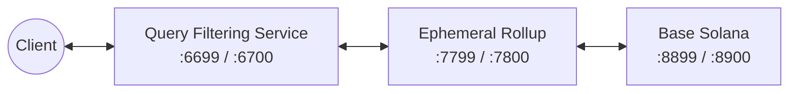

import Validators from "/snippets/notes/validators.mdx";

---

### Quick Access

Explore private program and test scripts for Anchor, Native Rust, and Pinocchio:

<CardGroup cols={2}>
  <Card
    title="Anchor Private Counter"
    icon="anchor"
    href="https://github.com/magicblock-labs/magicblock-engine-examples/tree/main/private-counter"
    iconType="duotone"
  >
    Anchor implementation with permissions.
  </Card>
  <Card
    title="Pinocchio Private Counter"
    icon="code"
    href="https://github.com/magicblock-labs/magicblock-engine-examples/tree/main/pinocchio-private-counter"
    iconType="duotone"
  >
    Pinocchio implementation with magic permission accounts.
  </Card>
</CardGroup>

---

## Why a Local PER Setup Is Different

In production a **Private Ephemeral Rollup** runs the Ephemeral Rollup inside a
**Trusted Execution Environment (TEE)** on Intel TDX. Clients don't reach the ER
directly — they connect through a **token-gated TEE endpoint** that enforces
privacy and compliance (IP geofencing, OFAC screening, and per-account
[permission filtering](/pages/private-ephemeral-rollups-pers/how-to-guide/access-control))
at ingress, before any transaction is accepted or executed.

You can't run real TDX hardware locally. Instead, the TEE ingress is emulated by
a dedicated process — the **Query Filtering Service (QFS)** — which replicates
the same token-auth and permission-filtering logic **without** hardware
attestation, and fronts an ordinary local ephemeral validator.

That is the only structural difference from a plain
[Ephemeral Rollup local setup](/pages/ephemeral-rollups-ers/how-to-guide/local-development):
**you run the QFS in front of the ER and point your client at the QFS instead of
the ER directly.**

## Topology

Four processes, each fronting the next:



| Process                   | RPC / WS    | Role                                                                                                      |
| ------------------------- | ----------- | --------------------------------------------------------------------------------------------------------- |
| `mb-test-validator`       | 8899 / 8900 | Base layer. Wraps `solana-test-validator` and pre-clones the MagicBlock delegation + permission programs. |
| `ephemeral-validator`     | 7799 / 7800 | The Ephemeral Rollup itself.                                                                              |
| `query-filtering-service` | 6699 / 6700 | **PER-specific.** Emulates the TEE ingress — token auth + permission filtering.                           |
| `vrf-oracle` (optional)   | —           | Only needed if the program under test uses VRF.                                                           |

<Note>
  Point your client at the **QFS (6699)** to test privacy features. Point it at
  the **ER (7799)** directly when you don't need the privacy layer.
</Note>

## Quickstart with mb-stack

`mb-stack` is a single CLI that wraps `mb-test-validator`, `ephemeral-validator`,
and `query-filtering-service`, and handles the startup ordering between them for
you, in a single command. It ships in the same package as `ephemeral-validator`.

<Steps>
  <Step title="Install">
    ```bash
    npm install -g @magicblock-labs/ephemeral-validator@latest
    ```
  </Step>

  <Step title="Bring up the full stack">
    ```bash
    mb-stack --reset
    ```

    This starts `mb-test-validator` (8899 / 8900), `ephemeral-validator`
    (7799 / 7800), and `query-filtering-service` (6699 / 6700) together, on the
    same default ports used throughout this guide.
  </Step>

  <Step title="Deploy your program">
    Once the stack is up, deploy against the base layer as usual:

    <Tabs>
      <Tab title="Anchor">
        ```bash
        anchor build && anchor deploy --provider.cluster localnet
        ```
      </Tab>
      <Tab title="Native / Pinocchio">
        ```bash
        cargo build-sbf
        solana config set --url localhost
        solana program deploy YOUR_PROGRAM_PATH
        ```
      </Tab>
    </Tabs>

  </Step>
</Steps>

## Per-Service Setup

<Steps>
  <Step title="Install the binaries">
    `mb-stack`, `ephemeral-validator`, `query-filtering-service`, and `mb-test-validator` ship together:

    ```bash
    npm install -g @magicblock-labs/ephemeral-validator@latest
    ```
  </Step>

  <Step title="Start the base validator (port 8899)">
    ```bash
    mb-test-validator --reset
    ```
  </Step>

  <Step title="Deploy or preload your program">
    <Tabs>
      <Tab title="Anchor">
        ```bash
        anchor build && anchor deploy --provider.cluster localnet
        ```
      </Tab>
      <Tab title="Native / Pinocchio">
        ```bash
        cargo build-sbf
        solana config set --url localhost
        solana program deploy YOUR_PROGRAM_PATH
        ```
      </Tab>
      <Tab title="Preload at startup">
        Alternatively, inject the program when the base validator boots so it is
        on-chain at its declared address from slot 0:

        ```bash
        mb-test-validator --reset \
          --upgradeable-program <program-keypair.json> <program.so> <upgrade-authority-pubkey>
        ```
      </Tab>
    </Tabs>

  </Step>

  <Step title="Start the ephemeral validator (port 7799)">
    ```bash
    ephemeral-validator \
      --lifecycle ephemeral \
      --remotes http://127.0.0.1:8899 \
      --remotes ws://127.0.0.1:8900 \
      --listen 127.0.0.1:7799 \
      --reset
    ```
  </Step>

  <Step title="Start the Query Filtering Service (port 6699)">
    This is the process that makes it a **private** rollup. It points upstream at
    the ER and exposes the client-facing endpoint:

    ```bash
    RUST_LOG=info query-filtering-service \
      --listen-addr 127.0.0.1:6699 \
      --listen-addr-ws 127.0.0.1:6700 \
      --ephemeral-url http://127.0.0.1:7799 \
      --ephemeral-url-ws ws://127.0.0.1:7800 \
      --token-expiry-days 180 \
      --add-cors-headers
    ```

    `--add-cors-headers` is required if you test from a browser app. Wait for
    port `6699` to accept a connection before firing any request.

  </Step>

  <Step title="(Optional) Start the VRF oracle">
    If your program requests randomness, run one oracle against the base layer and
    one against the ER:

    ```bash
    # Base-layer VRF requests
    VRF_ORACLE_SKIP_PREFLIGHT=true RPC_URL=http://localhost:8899 \
      WEBSOCKET_URL=ws://localhost:8900 RUST_LOG=info vrf-oracle &

    # ER VRF requests
    VRF_ORACLE_SKIP_PREFLIGHT=true RPC_URL=http://localhost:7799 \
      WEBSOCKET_URL=ws://localhost:7800 RUST_LOG=info vrf-oracle &
    ```
  </Step>
</Steps>

## Connect Your Client Through the QFS

Your client treats the **QFS endpoint as the TEE endpoint**: point
`TEE_PROVIDER_ENDPOINT` at `http://localhost:6699` and reuse the same
[authorization flow](/pages/private-ephemeral-rollups-pers/how-to-guide/quickstart#4-authorize)
from the quickstart — fetch a token by signing a challenge, then open the
connection with `?token=...` attached. When a PDA is set to private via its
`EphemeralPermission`, the QFS blocks any wallet not in the member list — exactly
as the TEE would on devnet.

```ts
import { getAuthToken } from "@magicblock-labs/ephemeral-rollups-sdk";
import nacl from "tweetnacl";

// Locally, TEE_PROVIDER_ENDPOINT = http://localhost:6699 (the QFS).
const teeUrl =
  process.env.TEE_PROVIDER_ENDPOINT || "https://devnet-tee.magicblock.app";
const teeWsUrl =
  process.env.TEE_WS_ENDPOINT || "wss://devnet-tee.magicblock.app";

const token = await getAuthToken(
  teeUrl,
  payer.publicKey,
  (message: Uint8Array) =>
    Promise.resolve(nacl.sign.detached(message, payer.secretKey)),
);

const erProvider = new anchor.AnchorProvider(
  new anchor.web3.Connection(`${teeUrl}?token=${token.token}`, {
    wsEndpoint: `${teeWsUrl}?token=${token.token}`,
    commitment: "confirmed",
  }),
  anchor.Wallet.local(),
);
```

<Note>
  `verifyTeeRpcIntegrity` checks a real TDX attestation and is meant for the
  devnet/mainnet TEE endpoints. The local QFS has no hardware attestation, so
  skip that check when running fully local.
</Note>

## Delegate to the Local Validator Identity

When delegating your PDA in a local test, delegate to the **localnet ER
identity** — not a devnet/mainnet one — so commits and undelegations settle
correctly:

```
mAGicPQYBMvcYveUZA5F5UNNwyHvfYh5xkLS2Fr1mev
```

<Validators />

## Endpoint Environment Variables

Centralize the endpoints so tests hit the local cluster instead of silently
falling back to devnet. The PER-relevant variables:

```bash
export PROVIDER_ENDPOINT=http://localhost:8899            # base layer
export WS_ENDPOINT=ws://localhost:8900
export EPHEMERAL_PROVIDER_ENDPOINT=http://localhost:7799  # ER direct
export EPHEMERAL_WS_ENDPOINT=ws://localhost:7800
export QFS_ENDPOINT=http://localhost:6699                 # QFS
export QFS_WS_ENDPOINT=ws://localhost:6700
export TEE_PROVIDER_ENDPOINT=$QFS_ENDPOINT                # private tests read this
export TEE_WS_ENDPOINT=$QFS_WS_ENDPOINT
export VALIDATOR=mAGicPQYBMvcYveUZA5F5UNNwyHvfYh5xkLS2Fr1mev
```

---
